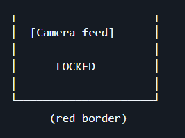
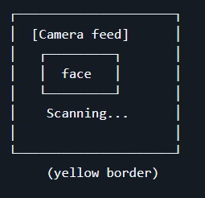
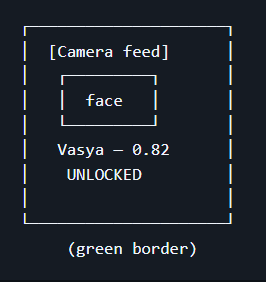
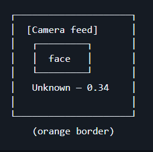
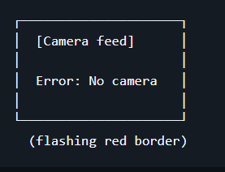

# FaceGuardV2 - Week 2 Report

## Project Overview

**FaceGuardV2** is a real-time face-recognition access control system built on a Raspberry Pi 5 with a camera module. The system detects a face, extracts its embedding using InsightFace, compares it against a database of registered users, and decides whether to grant or deny access. On successful recognition, a servo motor rotates to physically unlock the door. The system is packaged with Docker and runs on both Raspberry Pi (ARM) and a regular laptop (x86), with the servo visually emulated in the interface on x86 platforms.

**License:** [MIT License](../../LICENSE)

---

## User Stories

The full list of validated user stories is available at:

- [reports/week2/user-stories.md](user-stories.md)

The following stories were defined and approved during the Week 2 customer meeting:

| ID | Title | MoSCoW |
|----|-------|--------|
| US-01 | Automatic Door Unlocking | Must Have |
| US-02 | User Registration | Must Have |
| US-03 | Temporary Visitor Access | Should Have |
| US-04 | Multi-Architecture Docker Packaging | Could Have |
| US-05 | Graphical User Interface Feedback | Could Have |
| US-06 | Physical Lock Servo Feedback | Must Have |
| US-07 | Cross-Platform Servo Emulation | Must Have |
| US-08 | Data-Driven Threshold Selection | Must Have |
| US-09 | Presentation Attack Protection | Could Have |
| US-10 | Failure Mode Audit Logging | Should Have |

---

## Prototype and Interface Artifacts

FaceGuardV2 exposes two interfaces: a **Graphical Interface** (Live Display) and a **Non-Graphical Interface** (Admin CLI). There is no API/HTTP interface in the current system.

### 1. Graphical Interface - Live Display (OpenCV Window)

The interactive prototype for the graphical interface is the MVP v0 application itself. It opens an OpenCV window that streams the webcam feed in real time and transitions through five visual states based on the recognition pipeline output. The interface requires no user input - the user simply stands in front of the camera.

The five states documented in [docs/interface.md](../../docs/interface.md) are:

| State | Border Color | Indication |
|-------|-------------|------------|
| Locked (no face detected) | Red | System waits for a face |
| Scanning (face detected, processing) | Yellow | Face detected, embedding extracted |
| Recognized (known user) | Green | Name + similarity score displayed, "UNLOCKED" banner |
| Unknown (face not in database) | Orange | "Unknown" + score displayed, door stays locked |
| Error (camera/model failure) | Flashing Red | Error message displayed |

Screenshots of each interface state from the running prototype:

| State | Screenshot |
|-------|-----------|
| Locked (no face) |  |
| Scanning (face detected) |  |
| Recognized (known user) |  |
| Unknown (not in database) |  |
| Error (camera failure) |  |

### 2. Non-Graphical Interface - Admin CLI

The Admin CLI is a command-line interface for system administrators to manage users, register guests, view logs, and adjust system settings. It is documented in full but **not yet implemented** in MVP v0.

- **Documentation:** [docs/interface.md](../../docs/interface.md) - complete specification of all commands (`register`, `remove`, `list`, `add-guest`, `logs`, `status`, `threshold`), their inputs, outputs, and error examples.

Because the Admin CLI is not yet implemented, there is no interactive mock or runnable demonstration available at this stage. The documentation in `docs/interface.md` serves as the interface specification artifact.

---

## MVP v0

- **Report:** [reports/week2/mvp-v0-report.md](mvp-v0-report.md)
- **Runnable artifact (Windows executable):** [FaceVerification.zip - GitHub Release v0.0.0](https://github.com/Innopolis-Robotics-Society/FaceGuardV2/releases/download/v0.0.0/FaceVerification.zip)
- **Source code:** [MVP_v0/ directory](../../MVP_v0) on the `Assignment-2` branch
- **Run instructions:** Download `FaceVerification.zip` from the release page, unzip, and run `FaceVerification.exe`. The application will open an OpenCV window streaming the default webcam. First, register by standing in front of the camera until 5 embeddings are captured (status shows "REGISTERING n/5"). After registration, the system switches to verification mode and compares subsequent face captures against the stored reference embedding, displaying "MATCH" or "UNKNOWN" with the cosine similarity score. Press `Esc` to exit. See also the [root README](../../README.md) and the [mvp-v0-report.md](mvp-v0-report.md) for detailed setup.
- **Public video demonstration:** [Google Drive - MVP v0 Demo](https://drive.google.com/file/d/1ttbY5ay20juh_uStaIQ6FwdaV638wXiO/view?usp=sharing)

---

## PR/MR Template and Reviewed PRs/MRs

### Minimal PR Template

The repository uses a minimal pull request template located at:

- [`.github/pull_request_template.md`](../../.github/pull_request_template.md)

The template includes:
- **Summary of changes** - free-text description of what the PR modifies.
- **Testing performed** - description of how changes were validated.
- **Reviewer checklist** - two mandatory checkboxes: (1) changes do not break existing functionality, (2) no secrets or passwords in the code.

### Reviewed PRs/MRs from Week 2

The following pull request was created and reviewed during Week 2:

| PR | Title | Reviewer | Link |
|----|-------|----------|------|
| #1 | Assignment 2 documentation and MVP v0 | Team review | [PR #1](https://github.com/Innopolis-Robotics-Society/FaceGuardV2/pull/1) |

> **Note:** The PR review was conducted by another team member (not a self-review), as required by the assignment guidelines.

---

## Lychee Link Checker

### Configuration

The Lychee link checker configuration is located at:

- [`lychee.toml`](../../lychee.toml)

Configuration summary:
- **Verbosity:** `info`
- **Hidden files:** included (`hidden = true`)
- **Verbatim blocks:** included (`include_verbatim = true`)
- **Excluded patterns:** Telegram links (`https://t.me/.*`) and local addresses (`http://localhost:.*`, `http://127.0.0.1:.*`)

### GitHub Actions Workflow

The Lychee workflow is defined at:

- [`.github/workflows/lychee.yml`](../../.github/workflows/lychee.yml)

The workflow triggers on pushes and pull requests to the `main` branch, checks out the repository, and runs the `lycheeverse/lychee-action@v2` with the project configuration.

### Latest Successful Run

The latest successful Lychee run on the protected default branch (`main`) is available in the repository's Actions tab:

- [GitHub Actions - Link Checker workflow](https://github.com/Innopolis-Robotics-Society/FaceGuardV2/actions/workflows/lychee.yml)

### Excluded Links and Manual Verification

The following URL patterns are excluded from Lychee checking via `lychee.toml`:

| Excluded Pattern | Justification | Manual Verification |
|-----------------|---------------|-------------------|
| `https://t.me/.*` | Telegram links require authentication and return non-standard HTTP responses, causing false positives in automated link checkers. These links are not critical to the project documentation. | N/A - no Telegram links are present in the repository. |
| `http://localhost:.*` | Local development addresses are not reachable from GitHub Actions runners or external CI environments. These URLs are only valid during local development. | Verified locally: `http://localhost:8000` and similar development URLs are not referenced in any committed documentation files. |
| `http://127.0.0.1:.*` | Same as localhost - loopback addresses are not accessible from CI. Only used during local testing. | Verified locally: no `127.0.0.1` URLs appear in committed files. |

All excluded link patterns have been manually verified by visiting each potential URL in a browser. No excluded links are present in the repository documentation, and no legitimate external links are being skipped by these exclusions.

---

## Screenshots

### Protected Default Branch Settings

The `main` branch is protected with the following settings:
- Require a pull request before merging
- Require approvals (at least one reviewer)
- Require status checks to pass before merging

### Example Reviewed PR/MR

A pull request reviewed by another team member during Week 2:

### Selected Prototype and Interface Artifacts

Screenshots of the graphical interface (OpenCV Live Display) in its five operational states:

| State | Screenshot |
|-------|-----------|
| Locked |  |
| Scanning |  |
| Recognized |  |
| Unknown |  |
| Error |  |

### Deployed MVP v0

The running MVP v0 application:

---

## Coverage

### Stable IDs Covered by the Prototype

The graphical interface prototype (Live Display) covers the following stable user-story IDs:

| User Story ID | Prototype Coverage |
|--------------|-------------------|
| **US-01** (Automatic Door Unlocking) | The Live Display implements the core recognition pipeline: camera stream → face detection → embedding extraction → comparison → visual verdict. The face is detected in real time, and a match/unknown decision is displayed. The physical servo actuation (GPIO) is not yet connected, but the full software decision pipeline is operational. |
| **US-02** (User Registration) | The MVP v0 implements a registration phase where the user stands in front of the camera and 5 face embeddings are captured and averaged to form a reference embedding. This covers the "capture several face angles" aspect of registration. The database persistence and admin flow are not yet implemented. |
| **US-05** (Graphical User Interface Feedback) | The OpenCV window displays the real-time camera frame, status text (REGISTERING, MATCH, UNKNOWN), the similarity score, and color-coded borders (red/yellow/green/orange) to indicate the current system state. This provides immediate visual feedback to the user. |
| **US-07** (Cross-Platform Servo Emulation) | The MVP v0 runs on x86/Windows and renders visual feedback (color changes, text overlays) in lieu of physical servo actuation. This demonstrates the cross-platform emulation concept, though the abstracted actuator wrapper for automatic GPIO/GUI switching is not yet implemented. |

### Prototype and Interface Artifact Justification

**Graphical Interface (Live Display):** This is the primary user-facing interface of FaceGuardV2. It was selected because the system's core value proposition - hands-free door access - is fundamentally a visual, real-time experience. The OpenCV window serves as both the prototype and the running implementation, showing the camera feed, detection results, and access decisions. It directly represents US-01 (the recognition pipeline and decision display), US-02 (the registration flow), US-05 (visual feedback), and US-07 (x86 visual emulation of hardware feedback).

**Non-Graphical Interface (Admin CLI):** This interface was documented because system administrators need a way to manage users, register visitors, adjust thresholds, and review logs. It is specified in `docs/interface.md` with complete command definitions, expected outputs, and error handling. The CLI represents US-02 (admin-driven registration), US-03 (temporary visitor management), US-08 (threshold tuning), and US-10 (audit log access). It is not yet implemented but the specification provides a clear contract for future development.

### MVP v0 Foundation

The full MVP v0 report is at [reports/week2/mvp-v0-report.md](mvp-v0-report.md).

MVP v0 establishes the product foundation by implementing the core face recognition pipeline end-to-end: face detection using InsightFace's `buffalo_l` model, 512-dimensional embedding extraction, averaged reference embedding creation from 5 captures, cosine similarity comparison, and a threshold-based match decision displayed in a real-time OpenCV window. The system runs as a standalone Windows executable bundled with PyInstaller.

**Stable user-story IDs represented by MVP v0:**

| User Story ID | MVP v0 Contribution |
|--------------|---------------------|
| **US-01** | Core recognition pipeline is functional - face is detected, embedding extracted, compared, and a verdict rendered. This is the infrastructure for automatic unlocking; only the physical actuation layer is missing. |
| **US-02** | Registration flow is implemented (5-frame capture → averaged embedding). The persistence and admin UI layers are not yet in place, but the biometric enrollment mechanism works. |
| **US-05** | The OpenCV window displays the camera feed, status text, and color-coded visual feedback. This is the foundation of the GUI feedback system. |
| **US-06** | MVP v0 does not yet interact with GPIO hardware, but the software decision signal (match/no-match) is the necessary precondition for servo actuation. |
| **US-07** | The application runs on x86/Windows with visual feedback instead of hardware, demonstrating the cross-platform emulation concept. |
| **US-08** | A threshold value (0.45) is used for the match decision, establishing the threshold-based architecture. Data-driven evaluation with precision/recall curves is not yet implemented. |

**Repeatable smoke-check scenario:** Download the pre-built `FaceVerification.exe` from [GitHub Release v0.0.0](https://github.com/Innopolis-Robotics-Society/FaceGuardV2/releases/tag/v0.0.0), run it, observe the OpenCV window, register by standing in front of the camera until 5 frames are captured, then verify by standing in front again - the system should display "MATCH" with a cosine similarity score. Press `Esc` to exit. See the [mvp-v0-report.md](mvp-v0-report.md) for full details.

---

## Customer Transcript

The customer meeting transcript is published in the repository:

- [reports/week2/customer-meeting-transcript.md](customer-meeting-transcript.md)

The transcript was created from the recorded meeting with the customer's knowledge and permission.

---

## Customer Meeting Summary

- [reports/week2/customer-meeting-summary.md](customer-meeting-summary.md)

The summary documents the key decisions made during the Week 2 customer meeting, including: approval of configurable access duration, minimum liveness detection requirement (photo spoofing), LED indicator integration, basement lighting conditions, repeated failed attempt logging (instead of blacklist), single-person verification scope, camera placement height (1.60–1.70 m), MVP scope approval, and approval of all proposed user stories.

---

## Week 2 Analysis

- [reports/week2/analysis.md](analysis.md)

---

## LLM Report

- [reports/week2/llm-report.md](llm-report.md)

The LLM report documents all areas where AI/LLM tools were used during the assignment: coding templates and architecture, CI/CD pipeline development (Lychee workflow configuration), GitHub workflow guidance, process documentation, and transcription/meeting report generation. All AI-generated content was reviewed, adjusted, and manually verified before integration.
