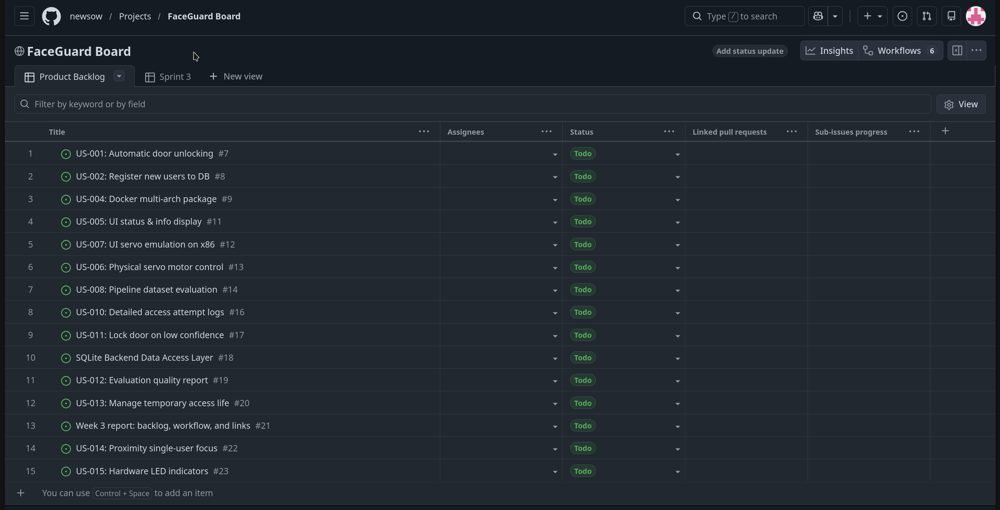
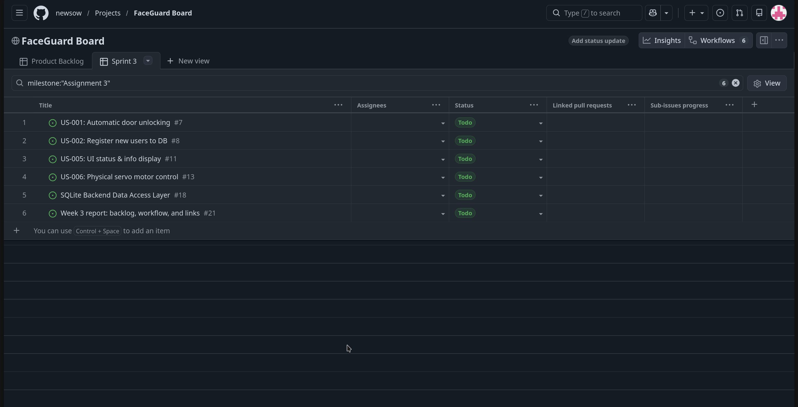
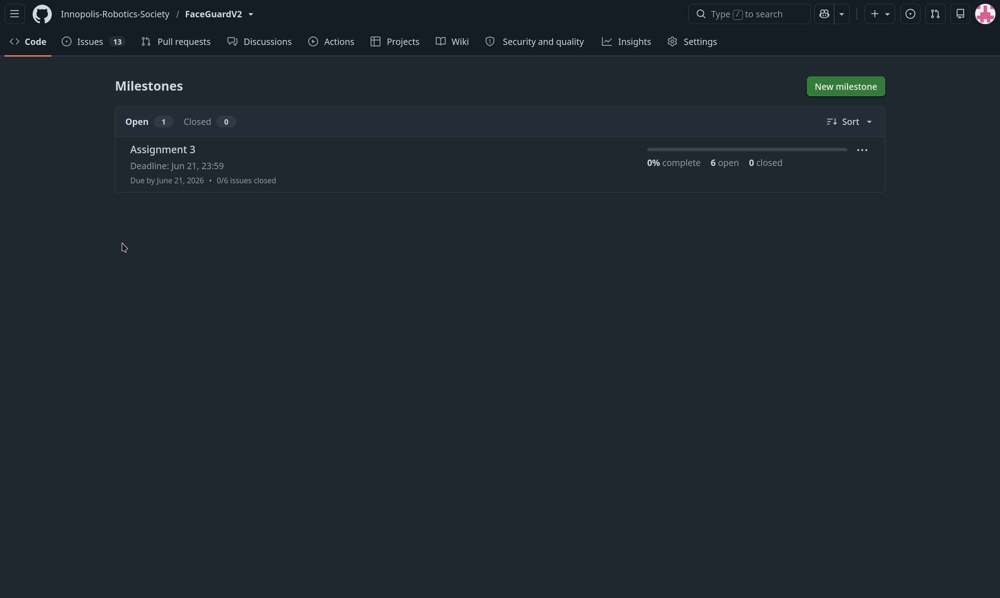
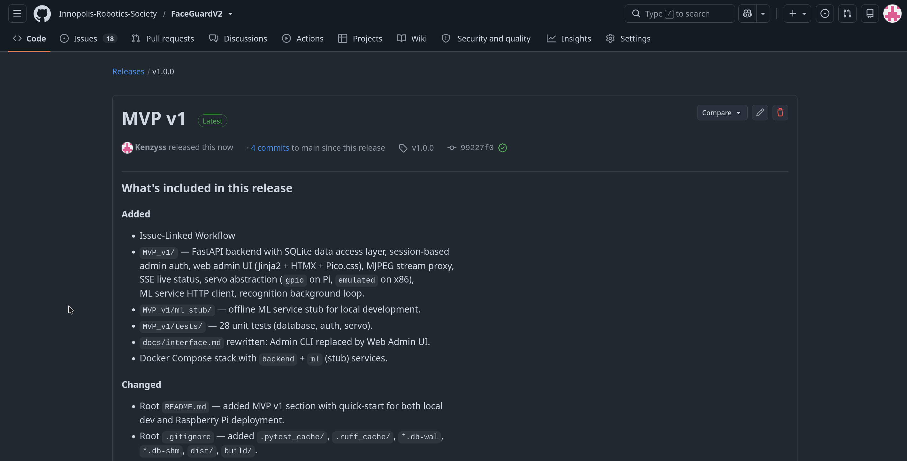
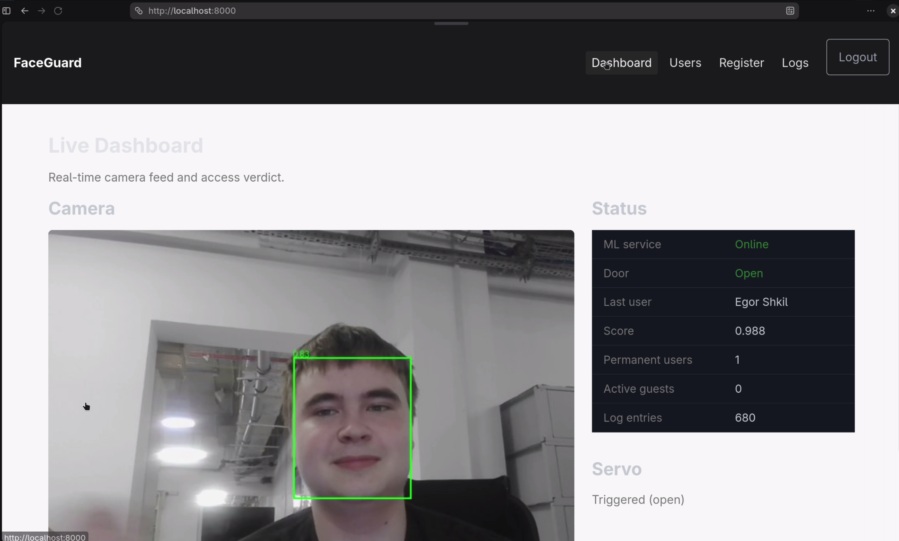
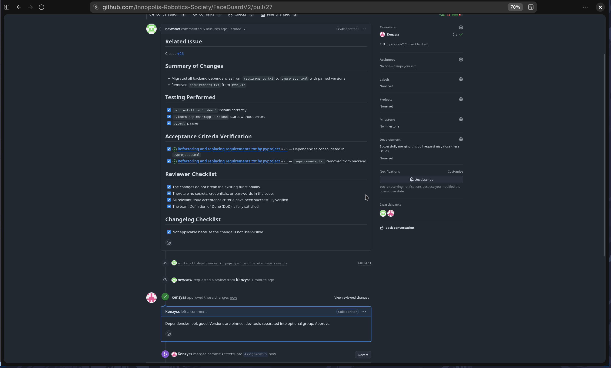

# FaceGuardV2 - Week 3 Report

**FaceGuardV2** is a real-time face-recognition access control system built on Raspberry Pi 5.
The system detects a face, extracts its embedding using InsightFace, compares it against a
registered-user database, and unlocks a physical door via servo motor on successful recognition.
Runs on both Raspberry Pi 5 (ARM) and x86 laptop, with servo visually emulated on x86.

**License:** [MIT License](../../LICENSE)

---

## User Story and PBI Scope Since Assignment 2

Since Assignment 2 the team kept all previously approved user stories and added supporting PBIs
for database integration. No stories were removed or deferred.

- Previous scope: [reports/week2/user-stories.md](../week2/user-stories.md)
- Current scope: [docs/user-stories.md](../../docs/user-stories.md)
- All issues: [Issue tracker](https://github.com/Innopolis-Robotics-Society/FaceGuardV2/issues)

| ID | Title | MoSCoW | SP | Status |
|----|-------|--------|----|--------|
| US-001 | Automatic Door Unlocking | Must Have | 8 | In Progress |
| US-002 | Register New Users to DB | Must Have | 8 | In Progress |
| US-003 | Temporary Visitor Access | Should Have | - | Backlog |
| US-004 | Multi-Architecture Docker Packaging | Could Have | - | Backlog |
| US-005 | UI Status & Info Display | Should Have | 5 | Backlog |
| US-006 | Physical Servo Motor Control | Must Have | 5 | Backlog |
| US-007 | Cross-Platform Servo Emulation | Must Have | - | Backlog |
| US-008 | Data-Driven Threshold Selection | Must Have | - | Backlog |
| US-009 | Presentation Attack Protection | Could Have | - | Backlog |
| US-010 | Failure Mode Audit Logging | Should Have | - | Backlog |

---

## Customer Feedback from Assignment 2 - Addressed in MVP v1

| Feedback point | How addressed in MVP v1 |
|----------------|------------------------|
| Registration needs multi-angle face capture | Implemented in US-002: pipeline captures multiple face angles before saving to DB |
| Repeated failed attempts should be logged, not blacklisted | Scoped into US-010; logging architecture defined for next sprint |
| Single-person verification scope confirmed | Reflected in US-001 acceptance criteria - one face at a time |
| Camera placement height 1.60–1.70 m | Added as constraint in US-001 notes |
| Minimum liveness detection required | Scoped into US-009 for a later sprint |

---

## Product Backlog

- [Product Backlog view](https://github.com/Innopolis-Robotics-Society/FaceGuardV2/issues)
- [Sprint Backlog view](https://github.com/Innopolis-Robotics-Society/FaceGuardV2/milestone/1)
- [Assignment 3 Milestone](https://github.com/Innopolis-Robotics-Society/FaceGuardV2/milestone/1)
  - authoritative source for Sprint Goal, Sprint dates, and Sprint scope

**Total Product Backlog:** 26 Story Points (across US-001, US-002, US-005, US-006)
**Current Sprint (Assignment 3):** 26 Story Points

---

## MVP v1 Scope

The MVP v1 filtered view corresponds to the current Product Backlog view above,
as all active PBIs are scoped for MVP v1.

MVP v1 delivers the core authentication loop: user registration via face capture
with embeddings stored in a local SQLite database, and automatic door unlocking
on recognition. The system runs in emulation mode on x86 (servo state shown in UI)
and is ready for physical Raspberry Pi 5 deployment.

| Item | Issue | SP |
|------|-------|----|
| US-001 Automatic Door Unlocking | [#7](https://github.com/Innopolis-Robotics-Society/FaceGuardV2/issues/7) | 8 |
| US-002 Register New Users to DB | [#8](https://github.com/Innopolis-Robotics-Society/FaceGuardV2/issues/8) | 8 |
| US-005 UI Status & Info Display | [#11](https://github.com/Innopolis-Robotics-Society/FaceGuardV2/issues/11) | 5 |
| US-006 Physical Servo Motor Control | [#13](https://github.com/Innopolis-Robotics-Society/FaceGuardV2/issues/13) | 5 |
| PBI: SQLite Backend Data Access Layer | [#18](https://github.com/Innopolis-Robotics-Society/FaceGuardV2/issues/18) | - |

---

## Workflow and Process

PBI types, Work Statuses, MoSCoW priorities, Sprint milestone usage, and Definition of Done
follow the shared definitions in
[Process_Requirements.md](../../docs/Process_Requirements.md).

**PBI types used:**
- **User Story** - functional requirement expressed as role / action / value
- **Other PBI** - technical task or infrastructure item (e.g. SQLite Backend #18)
- **Bug Report** - defect found during testing
- **Course Task** - assignment deliverable; not counted toward backlog size minimums

**Work Statuses:** Backlog → In Progress → In Review → Done (Blocked when needed)

**Sprint scope** is managed through the Assignment 3 GitHub Milestone,
which is the authoritative source for Sprint Goal, dates, and Sprint scope.

**MVP v1 tracking:** all active PBIs are scoped for MVP v1 and visible
in the Product Backlog view linked above.

**Task decomposition:** User Stories are broken into supporting PBIs
(e.g. SQLite Backend #18 supports US-002) when implementation requires
separable technical work tracked independently, each with its own acceptance criteria.

---

## Roadmap Summary

Assignment 3 Sprint delivers the core authentication loop with SQLite-backed
user registration and door unlocking in emulation mode.
The next sprint focuses on physical Raspberry Pi 5 deployment with GPIO servo control.

Full delivery plan: [docs/roadmap.md](../../docs/roadmap.md)

---

## MVP v1 Verification Evidence

| Item | PR | Evidence |
|------|----|----------|
| SQLite Backend (#18) | [PR #27](https://github.com/Innopolis-Robotics-Society/FaceGuardV2/pull/27) | Merged and approved; dependencies finalised |
| Repository workflow setup | [PR #6](https://github.com/Innopolis-Robotics-Society/FaceGuardV2/pull/6) | Issue forms merged and approved |
| Roadmap | [PR #15](https://github.com/Innopolis-Robotics-Society/FaceGuardV2/pull/15) | Updated roadmap merged and approved |
| Report images | [PR #28](https://github.com/Innopolis-Robotics-Society/FaceGuardV2/pull/28) | Screenshots merged and approved |
| Full report | [PR #31](https://github.com/Innopolis-Robotics-Society/FaceGuardV2/pull/31) | Report merged and approved |

---

## Current Product Status

The SQLite-backed data access layer is implemented and merged.
The face recognition pipeline from MVP v0 is integrated with persistent storage.
The system runs in emulation mode on x86 with the servo state displayed in the UI.
US-001, US-002, US-005, and US-006 are in active development within Assignment 3 Sprint.

---

## Next Steps

Complete US-001 (door unlocking), US-002 (DB registration), US-005 (UI display),
and US-006 (servo control). Then deploy to Raspberry Pi 5, connect the physical
servo motor via GPIO, and validate end-to-end with a real camera and door lock.

---

## Contribution Traceability

| Member | Issues | PRs opened | PRs reviewed |
|--------|--------|------------|--------------|
| @Kenzyss | [#10](https://github.com/Innopolis-Robotics-Society/FaceGuardV2/issues/10), [#21](https://github.com/Innopolis-Robotics-Society/FaceGuardV2/issues/21), [#24](https://github.com/Innopolis-Robotics-Society/FaceGuardV2/issues/24), [#25](https://github.com/Innopolis-Robotics-Society/FaceGuardV2/issues/25) |[PR #6](https://github.com/Innopolis-Robotics-Society/FaceGuardV2/pull/6), [PR #3](https://github.com/Innopolis-Robotics-Society/FaceGuardV2/pull/3), [PR #15](https://github.com/Innopolis-Robotics-Society/FaceGuardV2/pull/15), [PR #28](https://github.com/Innopolis-Robotics-Society/FaceGuardV2/pull/28) | [PR #27](https://github.com/Innopolis-Robotics-Society/FaceGuardV2/pull/27) |
| @newsow | [#18](https://github.com/Innopolis-Robotics-Society/FaceGuardV2/issues/18), [#8](https://github.com/Innopolis-Robotics-Society/FaceGuardV2/issues/8), [#9](https://github.com/Innopolis-Robotics-Society/FaceGuardV2/issues/9), [#26](https://github.com/Innopolis-Robotics-Society/FaceGuardV2/issues/26), [#30](https://github.com/Innopolis-Robotics-Society/FaceGuardV2/issues/30), [#18](https://github.com/Innopolis-Robotics-Society/FaceGuardV2/issues/18), [#7](https://github.com/Innopolis-Robotics-Society/FaceGuardV2/issues/7), [#11](https://github.com/Innopolis-Robotics-Society/FaceGuardV2/issues/11), [#13](https://github.com/Innopolis-Robotics-Society/FaceGuardV2/issues/13) | [PR #32](https://github.com/Innopolis-Robotics-Society/FaceGuardV2/pull/32), [PR #27](https://github.com/Innopolis-Robotics-Society/FaceGuardV2/pull/27) | [PR #6](https://github.com/Innopolis-Robotics-Society/FaceGuardV2/pull/6), [PR #31](https://github.com/Innopolis-Robotics-Society/FaceGuardV2/pull/31) |
| @b3ss0n | [#19](https://github.com/Innopolis-Robotics-Society/FaceGuardV2/issues/19), [#33](https://github.com/Innopolis-Robotics-Society/FaceGuardV2/issues/33) | [PR #31](https://github.com/Innopolis-Robotics-Society/FaceGuardV2/pull/31) | [PR #28](https://github.com/Innopolis-Robotics-Society/FaceGuardV2/pull/28) |
| @NadezhdaVoskan | [#12](https://github.com/Innopolis-Robotics-Society/FaceGuardV2/issues/12), [#14](https://github.com/Innopolis-Robotics-Society/FaceGuardV2/issues/14), [#16](https://github.com/Innopolis-Robotics-Society/FaceGuardV2/issues/16), [#17](https://github.com/Innopolis-Robotics-Society/FaceGuardV2/issues/17)| - | [PR #15](https://github.com/Innopolis-Robotics-Society/FaceGuardV2/pull/15) |
| @XeOneD | [#20](https://github.com/Innopolis-Robotics-Society/FaceGuardV2/issues/20) | - | - |
| @TheShamil | [#22](https://github.com/Innopolis-Robotics-Society/FaceGuardV2/issues/22), [#23](https://github.com/Innopolis-Robotics-Society/FaceGuardV2/issues/23) | - | - |

---

## Links

| Item | Link |
|------|------|
| SemVer release - MVP v1 | [v1.0.0](https://github.com/Innopolis-Robotics-Society/FaceGuardV2/releases/tag/v1.0.0) |
| CHANGELOG.md | [CHANGELOG.md](../../CHANGELOG.md) |
| Process Requirements | [Process_Requirements.md](../../docs/Process_Requirements.md) |
| Roadmap | [docs/roadmap.md](../../docs/roadmap.md) |
| Definition of Done | [docs/definition-of-done.md](../../docs/definition-of-done.md) |
| Issue template - User Story | [user_story.yml](../../.github/ISSUE_TEMPLATE/user_story.yml) |
| Issue template - Other PBI | [other_pbi.yml](../../.github/ISSUE_TEMPLATE/other_pbi.yml) |
| Issue template - Course Task | [course_task.yml](../../.github/ISSUE_TEMPLATE/course_task.yml) |
| Issue template - Bug Report | [bug_report.yml](../../.github/ISSUE_TEMPLATE/bug_report.yml) |
| PR template | [pull_request_template.md](../../.github/pull_request_template.md) |
| MVP v1 artifact | [GitHub Release v1.0.0](https://github.com/Innopolis-Robotics-Society/FaceGuardV2/releases/tag/v1.0.0) |
| Run instructions | [README.md - How to Run](../../README.md#how-to-run) |
| Demo video | [Yandex Disk - MVP v1 Demo](https://disk.yandex.ru/i/gqxa6rxTzG0uVQ) |

---

## Reviewed PRs - Week 3 Evidence

| PR | Title | Author | Reviewer |
|----|-------|--------|----------|
| [PR #6](https://github.com/Innopolis-Robotics-Society/FaceGuardV2/pull/6) | Issues forms | @Kenzyss | @newsow |
| [PR #15](https://github.com/Innopolis-Robotics-Society/FaceGuardV2/pull/15) | Updated roadmap | @Kenzyss | @NadezhdaVoskan |
| [PR #27](https://github.com/Innopolis-Robotics-Society/FaceGuardV2/pull/27) | Write all dependences in pyproject | @newsow | @Kenzyss |
| [PR #28](https://github.com/Innopolis-Robotics-Society/FaceGuardV2/pull/28) | Added images | @Kenzyss | @b3ss0n |
| [PR #31](https://github.com/Innopolis-Robotics-Society/FaceGuardV2/pull/31) | Assignment 3 | @b3ss0n | @newsow |

---

## Screenshots

---

## Customer Review

- [Customer review summary](customer-review-summary.md)
- [Customer review transcript](customer-review-transcript.md)

---

## Reflection, Retrospective, LLM

- [Week 3 Reflection](reflection.md)
- [Sprint Retrospective](retrospective.md)
- [LLM Usage Report](llm-report.md)
