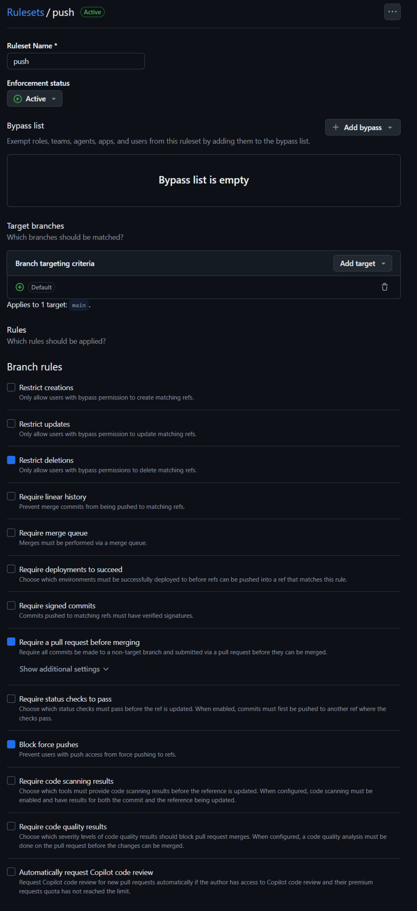
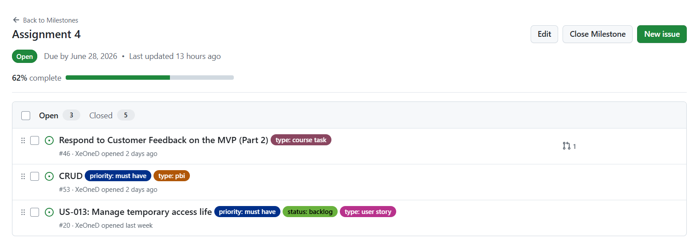
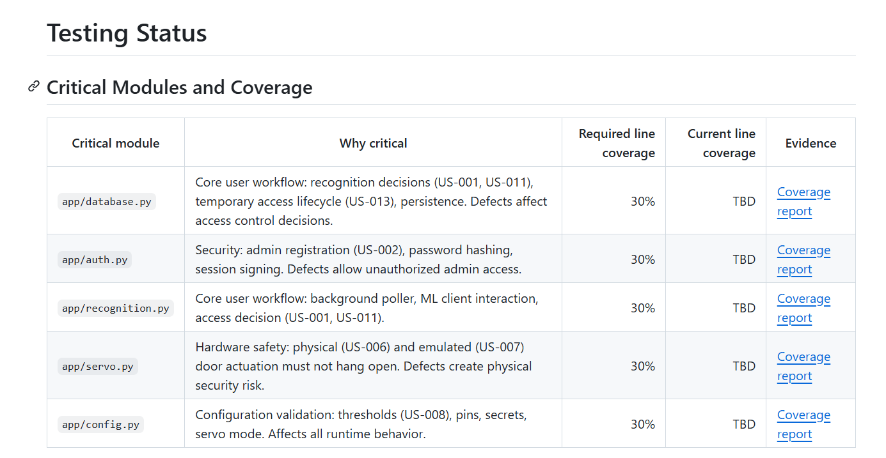
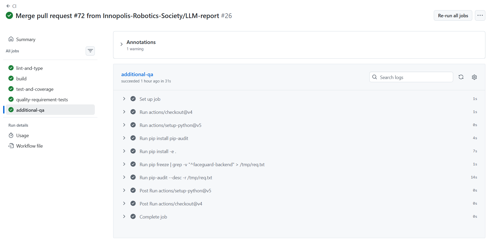
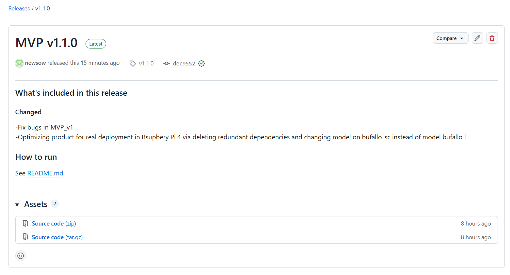
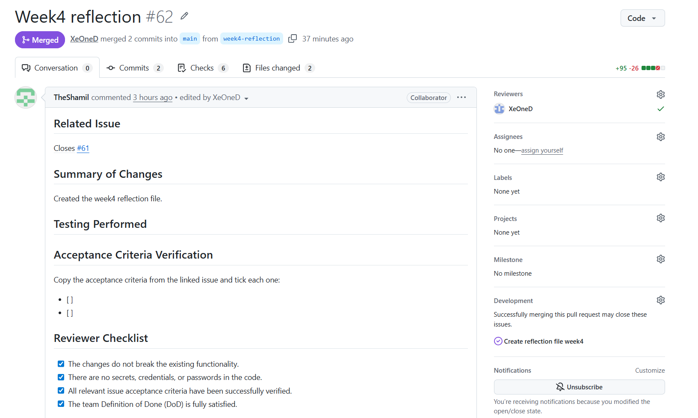

# FaceGuardV2 - Week 4 Report

**FaceGuardV2** is a real-time face-recognition access control system built on Raspberry Pi 5.
The system detects a face, extracts its embedding using InsightFace, compares it against a
registered-user database, and unlocks a physical door via servo motor on successful recognition.
Runs on both Raspberry Pi 5 (ARM) and x86 laptop, with servo visually emulated on x86.

**License:** [MIT License](../../LICENSE)

# Link to the product backlog
[Product backlog](https://github.com/Innopolis-Robotics-Society/FaceGuardV2/issues)
# Link to the sprint backlog
[Sprint backlog](https://github.com/Innopolis-Robotics-Society/FaceGuardV2/milestone/2)
# Link to the Assignment 4 Sprint milestone
[Sprint milestone](https://github.com/Innopolis-Robotics-Society/FaceGuardV2/milestone/2)
# Sprint Goal, Sprint dates, and short scope summary

# Total Sprint size in Story Points

# Summary of delivered product changes
- Fix bugs in MVP_v1  
- Optimizing product for real deployment in Rsupbery Pi 4 via deleting redundant dependencies and changing model on bufallo_sc instead of model bufallo_l
# Link to the runnable product
[Product](https://github.com/Innopolis-Robotics-Society/FaceGuardV2/releases/tag/v1.1.0)
# Link to current access or run instructions
[Run instruction](https://github.com/Innopolis-Robotics-Society/FaceGuardV2/blob/v1.1.0/README.md#how-to-run)
# Respond to Customer Feedback on the MVP
| Feedback point                                          | Resulting PBI or issue                                                     | Status                      | Response                                                                                                        |
|---------------------------------------------------------|----------------------------------------------------------------------------|-----------------------------|-----------------------------------------------------------------------------------------------------------------|
| The customer wants to see the full functionality of CRUD | [#53](https://github.com/Innopolis-Robotics-Society/FaceGuardV2/issues/53) | Planned for this Sprint     | Add Remove operation from the CRUD                                                                              |
| The customer asked to give temporary access dynamically | [#20](https://github.com/Innopolis-Robotics-Society/FaceGuardV2/issues/20) | Planned for this Sprint     | In the next version it should be possibility to give the constant access and change it to temporary dynamically |
| The customer asked about сheck for liveliness           | [#55](https://github.com/Innopolis-Robotics-Society/FaceGuardV2/issues/55) | Not planned for this Sprint | In the future versions of the product it might be added                                                         |

# Links
[docs/roadmap.md](https://github.com/Innopolis-Robotics-Society/FaceGuardV2/blob/main/docs/roadmap.md)  
[docs/definition-of-done.md](https://github.com/Innopolis-Robotics-Society/FaceGuardV2/blob/main/docs/definition-of-done.md)  
[docs/quality-requirements.md](https://github.com/Innopolis-Robotics-Society/FaceGuardV2/blob/main/docs/quality-requirements.md)  
[docs/quality-requirement-tests.md](https://github.com/Innopolis-Robotics-Society/FaceGuardV2/blob/main/docs/quality-requirement-tests.md)  
[docs/testing.md](https://github.com/Innopolis-Robotics-Society/FaceGuardV2/blob/main/docs/testing.md)  
[docs/user-acceptance-tests.md](https://github.com/Innopolis-Robotics-Society/FaceGuardV2/blob/main/docs/user-acceptance-tests.md)  

# Summary of the quality model used and selected ISO/IEC 25010 sub-characteristics
1. Functional SuitabilityFunctional Correctness (Accuracy): The system must guarantee reliable face recognition. This is continuously verified by evaluating the pipeline on validation datasets to calculate precise precision, recall, and F1-score metrics before setting classification thresholds.  Functional Completeness: The core software must fully execute the automated access loop, which includes registering user faces into the database and triggering physical mechanics upon successful identification.  

2. SecurityAccountability: The application guarantees full auditability by logging every access attempt in a structured database format. These audit logs capture critical metadata, including timestamps, recognition confidence scores, and categorical failures such as poor lighting or presence of masks.  Authenticity & Integrity: System integrity mandates that the door remains securely locked whenever confidence drops below the threshold or the user is unknown. Furthermore, future releases include a liveness detection check to prevent system spoofing via printed photographs.   

3. PortabilityAdaptability & Installability: The system is explicitly designed for cross-platform consistency by being fully packaged into multi-architecture Docker containers. This allows FaceGuardV2 to adapt and run seamlessly across both development/debugging laptops (x86) and target deployment edge units (ARM-based Raspberry Pi 5).  
 
4. MaintainabilityTestability: High testability is achieved by decoupling business logic from target hardware. The system uses a dedicated software abstraction (EmulatedServo) to simulate hardware feedback on non-ARM environments. This enables automated unit and integration tests to safely run in isolated CI environments while maintaining the required test coverage gate (above 30%).  Modularity & Analyzability: The codebase adheres to strict modular design principles, isolating database transactions from ML inferences. This is automatically enforced in the CI pipeline via static code analysis, utilizing tools like Ruff for linting/formatting and Mypy for static type checking to eliminate technical debt.
# Testing status summary, including critical modules and per-module line coverage status

# Links
**Unit tests:** [unit test 1](https://github.com/Innopolis-Robotics-Society/FaceGuardV2/blob/main/MVP_v1/tests/test_auth.py), [unit test 2](https://github.com/Innopolis-Robotics-Society/FaceGuardV2/blob/main/MVP_v1/tests/test_servo.py)  
[Integration tests](https://github.com/Innopolis-Robotics-Society/FaceGuardV2/blob/main/MVP_v1/tests/test_integration.py)  
[Automated quality requirement tests](https://github.com/Innopolis-Robotics-Society/FaceGuardV2/blob/main/MVP_v1/tests/test_database.py)  
[CI pipeline](https://github.com/Innopolis-Robotics-Society/FaceGuardV2/blob/main/.github/workflows/ci.yml)  
[Latest protected-default-branch CI run]()  

# Branch protection

# Report links for linting, coverage, tests, and the additional QA check
[Linting](https://github.com/Innopolis-Robotics-Society/FaceGuardV2/actions/runs/28289144695/job/83818036331)  
[Coverage](https://github.com/Innopolis-Robotics-Society/FaceGuardV2/blob/main/docs/testing.md)  
[Tests](https://github.com/Innopolis-Robotics-Society/FaceGuardV2/tree/main/MVP_v1/tests)  
[QA](https://github.com/Innopolis-Robotics-Society/FaceGuardV2/actions/runs/28289144695/job/83818036342)
# Influence of tests
1. Process Impact: Enforcing Quality Gates
Branch Protection: Tests act as an automated gatekeeper. Code cannot be merged into the main branch if the CI pipeline fails.
Definition of Done (DoD): Tasks cannot be finalized without proper test coverage, ensuring team alignment on code reliability.
Requirements Compliance: Directly secures and documents the mandatory code coverage threshold (above 30%) required for the submission.
2. Architectural Impact: Better Code Design
Hardware Abstraction: Because the GitHub CI environment lacks access to the physical Raspberry Pi hardware, testing forced the implementation of a software emulator (EmulatedServo). This successfully decoupled the core business logic from the hardware layer.
Environment Isolation: Using isolated database instances for test runs guarantees that the test suite is entirely reproducible and never corrupts live application data.
3. Technical Impact: Regression Prevention
Security Stability: Automated tests ensure that critical components like user authentication and password hashing remain unbroken during future code modifications or optimizations.
Quality Requirements: Automatically verifies non-functional requirements, such as mandatory audit logging for face recognition events and the automated expiration of guest access permissions
# SemVer release
[MVP v1.1.0](https://github.com/Innopolis-Robotics-Society/FaceGuardV2/releases/tag/v1.1.0)
# Link to CHANGELOG.md
[CHANGELOG.md](https://github.com/Innopolis-Robotics-Society/FaceGuardV2/blob/main/CHANGELOG.md)
# Demo video

# Presentation
[reports/week4/presentation.pdf]() 
# UAT results summary
Based on the MVP demonstration and the feedback table above, the customer acceptance results can be summarized as follows:

Current Sprint Adjustments: The customer approved the core MVP but requested two immediate enhancements. We have successfully prioritized and integrated these into the current sprint: completing the administrative lifecycle with a Remove operation and allowing dynamic switching between constant and temporary access rules.

Future Roadmap: The request for Liveness Detection (anti-spoofing) was recognized as a critical security upgrade and formally moved to the long-term product backlog to avoid disrupting the current deployment deadline.

Status: The MVP v1 has been formally accepted by the customer, subject to the active implementation of the two current sprint items.
# Link to the customer review transcript
[Transcript](https://github.com/Innopolis-Robotics-Society/FaceGuardV2/blob/main/reports/week4/customer-review-transcript.md)

# Links
[reports/week4/customer-review-summary.md](https://github.com/Innopolis-Robotics-Society/FaceGuardV2/blob/main/reports/week4/customer-review-summary.md)  
[reports/week4/reflection.md](https://github.com/Innopolis-Robotics-Society/FaceGuardV2/blob/main/reports/week4/reflection.md)  
[reports/week4/retrospective.md](https://github.com/Innopolis-Robotics-Society/FaceGuardV2/blob/main/reports/week4/retrospective.md)  
[reports/week4/llm-report.md](https://github.com/Innopolis-Robotics-Society/FaceGuardV2/blob/main/reports/week4/llm-report.md)

# Summary of the current product status
Core Functionality: The core MVP architecture—including user authentication, database management, and servo emulation—is functional and ready for further integration.

CI/CD Pipeline & Code Quality: The automated GitHub Actions pipeline is fully operational and completely green. It successfully runs code style linting and formatting using Ruff, along with static type checking via Mypy.

Testing & Coverage: Automated workflows successfully separate and execute unit tests and quality requirement tests. The overall code coverage meets the project's strict requirement of remaining above the 30% threshold.
# Summary of the next steps
Complete CRUD Capabilities: Implement the missing Remove operation for user and guest profiles to provide full administrative management lifecycle.

Dynamic Access Control: Develop a mechanism allowing administrators to dynamically shift access rules between constant and temporary permissions on the fly.

Maintain Quality Gates: Ensure that the implementation of these new features does not drop the overall test coverage below the required 30% threshold and passes all CI pipeline checks.

Biometric Anti-Spoofing: Initiate research and development for a Liveness Detection check to prevent spoofing attacks (e.g., bypassing the camera using a photo) and fully secure the face recognition module.
# Contribution traceability table
| Member | Contribution                                                                                                  |
|--------|---------------------------------------------------------------------------------------------------------------|
| @Kenzyss | Part 5, 8 assig 4 + part 7. The Product Repository Requirements file contains the part for the 4th assignment |
| @newsow |                                                                                                               |
| @b3ss0n | Analysed and summarised meeting with the client, formed the contribution of LLM                               |
| @NadezhdaVoskan |                                                                                                               |
| @XeOneD |                                                                                                               |
| @TheShamil | Updated the definition-of-done file according to the requirements, wrote the reflection.md file.              |

# Sprint milestone
  
  
  
  
  
  
  
