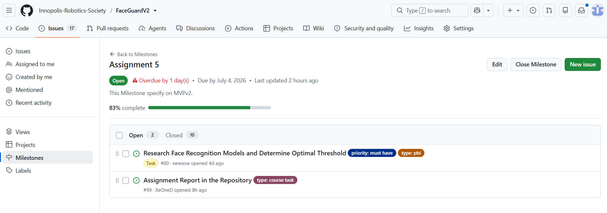
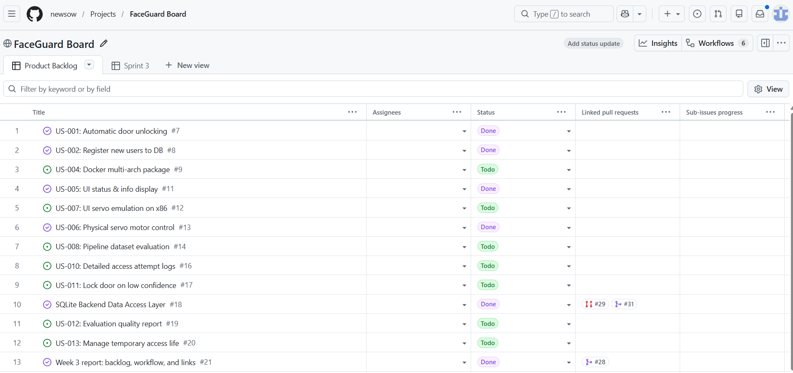
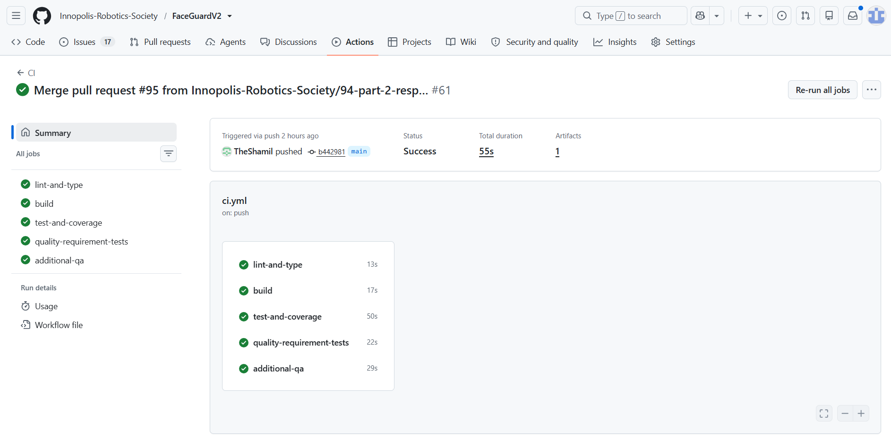
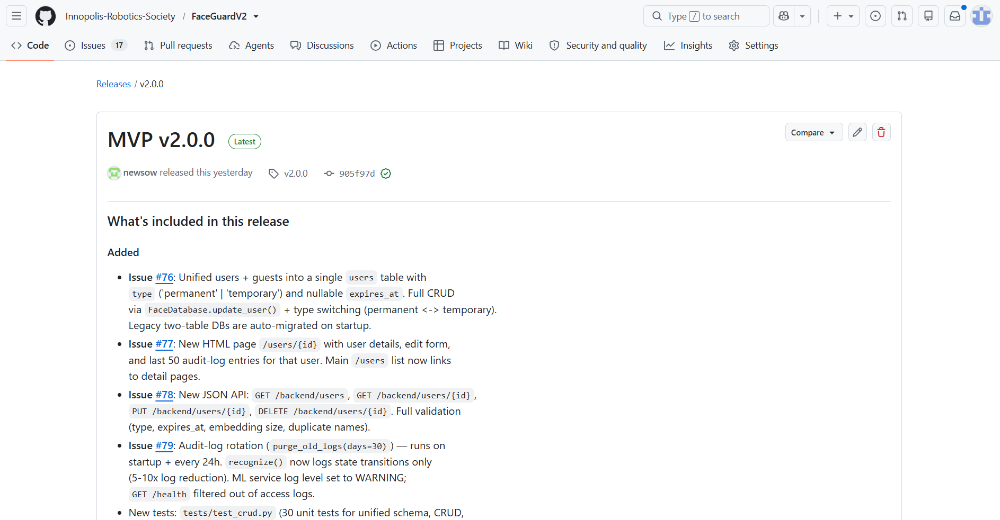
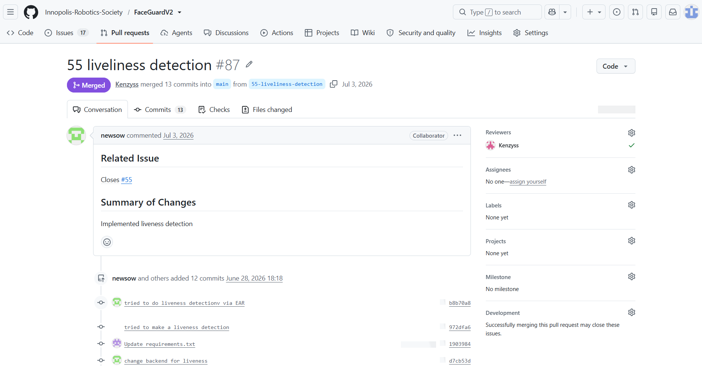
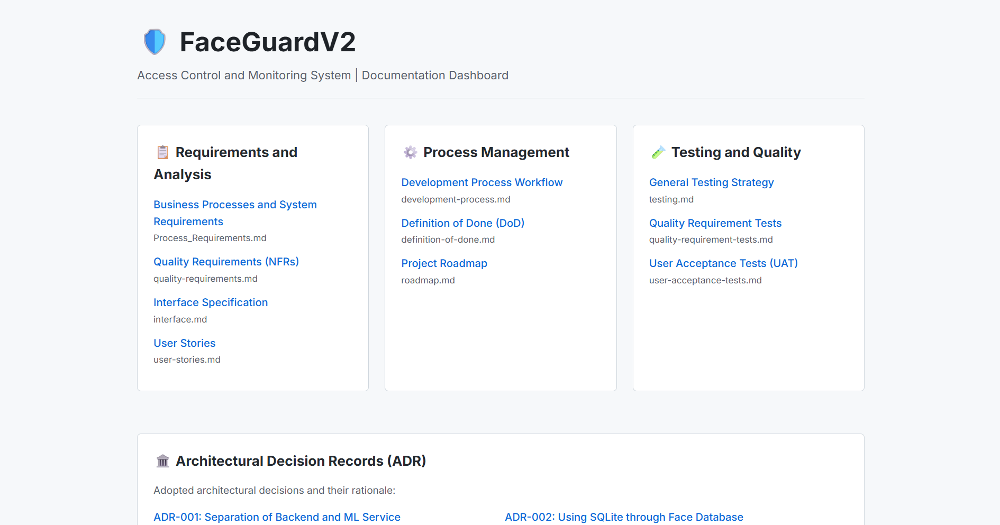

# FaceGuardV2 - Week 5 Report

**FaceGuardV2** is a real-time face-recognition access control system built on Raspberry Pi 5.
The system detects a face, extracts its embedding using InsightFace, compares it against a
registered-user database, and unlocks a physical door via servo motor on successful recognition.
Runs on both Raspberry Pi 5 (ARM) and x86 laptop, with servo visually emulated on x86.

**License:** [MIT License](../../LICENSE)

# Link to the product backlog
[Product backlog](https://github.com/Innopolis-Robotics-Society/FaceGuardV2/issues)
# Link to the sprint backlog
[Sprint backlog](https://github.com/Innopolis-Robotics-Society/FaceGuardV2/milestone/3)
# Link to the Sprint 3 milestone
[Sprint milestone](https://github.com/Innopolis-Robotics-Society/FaceGuardV2/milestone/3)
# Sprint Goal, Sprint dates, and short scope summary.
## Sprint Goal
Deliver a production-ready version of FaceGuardV2 by completing the core security and usability features required for real-world deployment. The sprint focuses on finalizing authentication and face recognition workflows, improving system reliability, addressing remaining defects, and preparing the project for comprehensive testing and release.

---

## Sprint Dates

**Start:** 29.06.26  
**End:** 05.07.26

---

## Scope Summary

During this sprint, the team worked on completing the remaining functional components of FaceGuardV2 while stabilizing the existing implementation.

### Completed
- Implemented and refined the remaining core application features.
- Improved face recognition and authentication workflows.
- Fixed high-priority bugs discovered during integration.
- Enhanced system stability and performance.
- Refactored parts of the codebase to improve maintainability.
- Completed integration of backend services with the user interface.
- Resolved issues identified during internal testing.

### Remaining
- Final validation of all application workflows.
- End-to-end testing and bug fixing.
- Performance optimization under realistic workloads.
- Documentation updates and deployment preparation.
- Final release candidate verification.

---

## Sprint Outcome

Sprint 3 significantly increased the maturity of FaceGuardV2 by completing most of the planned functionality and reducing technical debt. The remaining work is primarily focused on quality assurance, final optimization, and release readiness, making the next sprint the final step before project completion.

# Total Sprint size in Story Points
20
# Summary of delivered MVP v2 changes
Changed model on bufallo_sc instead of bufallo_l in ml_service/main.py  
FaceDatabase.recognize() now writes audit log entries only on state
transitions (verdict change or matched-name change). Pass
log_transitions_only=False to force per-call logging.  
ML service (ml_service/main.py, ml_stub/main.py) runs with
uvicorn --log-level warning and filters GET /health out of access
logs (issue #79).  
RecognitionLoop runs a daily purge_old_logs(30) to enforce log
retention policy.  
Root README.md documents the new endpoints and migration behavior.
# Link to the relevant product access artifact
[MVP v2](https://github.com/Innopolis-Robotics-Society/FaceGuardV2/releases/tag/v2.0.0)
# Link to current access or run instructions
[Instructions](https://github.com/Innopolis-Robotics-Society/FaceGuardV2/blob/v2.0.0/README.md#how-to-run)
# Customer feedback response table with feedback points and resulting PBIs or issues
| Feedback Point | Resulting PBI or Issue                                                                                                                                   | Status | Response / Action Taken |
| :--- |:---------------------------------------------------------------------------------------------------------------------------------------------------------| :---: | :--- |
| **User CRUD & Dynamic Access Lifecycle** The customer reviewed the implementation of user profile updates and dynamic access rule switching. | [#53](https://github.com/Innopolis-Robotics-Society/FaceGuardV2/issues/53) [#20](https://github.com/Innopolis-Robotics-Society/FaceGuardV2/issues/20) | **Delivered & Approved** | Successfully demonstrated that changing access type to *Permanent* nullifies the expiration field (`expires = null`), while *Temporary* allows explicit dynamic adjustments. The customer approved the flow. |
| **Blinking Liveness Detection vs. Video Spoofing** The customer noted that while the active blinking check successfully blocks photos, it can still be bypassed using a high-quality video recording. | [#55](https://github.com/Innopolis-Robotics-Society/FaceGuardV2/issues/55)                                                                               | **Deferred / Long-term Backlog** | The customer agreed that video anti-spoofing is highly complex and requires heavy artifact analysis models. They explicitly stated that **photo protection is sufficient for the current scope**, treating video protection as a post-project bonus. Future research into **Motion Control** (head-turning prompts) is logged. |
| **Model Optimization for CPU Execution** The team informed the client about migrating under the hood to the lightweight `buffalo_sc` model for CPU-based edge processing. | [#80](https://github.com/Innopolis-Robotics-Society/FaceGuardV2/issues/80)                                                                               | **In Progress / Threshold Tuning** | The customer supported the transition to a hardware-optimized model and inquired about immediate physical validation. The team is currently calibrating target classification thresholds. |
| **Urgency of Target Hardware Integration** The customer emphasized the need to accelerate deployment testing on the physical edge unit. | [#100](https://github.com/Innopolis-Robotics-Society/FaceGuardV2/issues/100)                                                                                                                                                 | **Planned for Next Week** | The team committed to scheduling physical integration and deployment on the target Raspberry Pi hardware during the upcoming week. |
| **Laboratory SD Card Storage Congestion** The customer warned that shared lab SD cards are overloaded and lack sufficient memory for stable deployment. | Should be solved in real life                                                                                                                            | **Open Task** | The team acknowledged the constraint. Following the client's explicit advice, members will source an independent, dedicated SD card to prevent runtime memory faults during deployment testing. |

# Explanation of feedback not addressed
During the customer review, one key piece of feedback was left unaddressed in the current system increment:

* **Advanced Anti-Spoofing against Video Playback:** The customer noted that the active blinking liveness check could still be bypassed using high-quality video recordings of an authorized user. 
* **Reason for not addressing in this Sprint:** Implementing full protection against video spoofing (such as texture/artifact analysis or dynamic motion control with head-turning prompts) requires complex secondary model architectures and user-notification interfaces. The customer explicitly agreed that protecting the system against static photographs is fully sufficient for the current scope and project deadline. Therefore, video bypass protection was formally categorized as an out-of-scope "bonus" feature and deferred to the long-term product backlog to avoid risking target hardware deployment timelines.
# Links
[docs/roadmap.md](https://github.com/Innopolis-Robotics-Society/FaceGuardV2/blob/main/docs/roadmap.md)  
[docs/definition-of-done.md](https://github.com/Innopolis-Robotics-Society/FaceGuardV2/blob/main/docs/definition-of-done.md)  
[docs/testing.md](https://github.com/Innopolis-Robotics-Society/FaceGuardV2/blob/main/docs/testing.md)  
[docs/quality-requirements.md](https://github.com/Innopolis-Robotics-Society/FaceGuardV2/blob/main/docs/quality-requirements.md)  
[docs/quality-requirement-tests.md](https://github.com/Innopolis-Robotics-Society/FaceGuardV2/blob/main/docs/quality-requirement-tests.md)  
[docs/user-acceptance-tests.md](https://github.com/Innopolis-Robotics-Society/FaceGuardV2/blob/main/docs/user-acceptance-tests.md)  
[docs/development-process.md](https://github.com/Innopolis-Robotics-Society/FaceGuardV2/blob/main/docs/development-process.md)  
[docs/architecture/README.md](https://github.com/Innopolis-Robotics-Society/FaceGuardV2/blob/main/docs/architecture/README.md)  

# Links to the static, dynamic, and deployment view artifacts
[Static](https://github.com/Innopolis-Robotics-Society/FaceGuardV2/tree/main/docs/architecture/static-view)
[Dynamic](https://github.com/Innopolis-Robotics-Society/FaceGuardV2/tree/main/docs/architecture/dynamic-view)
[Deployment](https://github.com/Innopolis-Robotics-Society/FaceGuardV2/tree/main/docs/architecture/deployment-view)

# Link to the ADR directory
[ADR](https://github.com/Innopolis-Robotics-Society/FaceGuardV2/tree/main/docs/architecture/adr)

# Summary of the Architecture and How it Supports the Product
The FaceGuardV2 system implements a decoupled, service-oriented architecture tailored for flexible multi-environment execution. The core stack and its operational support include:
*   **Component Breakdown**: The system consists of a FastAPI backend managing web routes, session authentication, and access control orchestration, paired with an isolated ML service handling local camera access and face embedding extraction. Data persistence is managed via an SQLite database layer, while a dedicated servo controller abstracts physical door locks.
*   **Decoupled ML Boundaries**: Isolating the heavy OpenCV and InsightFace dependencies inside a separate ML service container ensures that the primary FastAPI backend remains lightweight and unaffected by internal machine learning library updates.
*   **Multi-Environment Deployment**: Using Docker Compose allows the application to run seamlessly across distinct host setups. It directly supports deployment on target edge hardware (Raspberry Pi 4) with physical GPIO mappings, while enabling full testing, development, and code review on standard development laptops (x86) via an emulated software servo mode.
*   **Data and Configuration Integrity**: The architecture utilizes data volume mounts to ensure strict data persistence across container rebuilds, while runtime parameters are safely managed via environmental variables (`.env`) without committing system secrets.

# Link Between Quality Requirements and Architecture Decisions
The systemic quality attributes of FaceGuardV2 are explicitly tied to architectural decisions (ADRs) and component responsibilities to guarantee high maintainability and testability:

*   **Recognition Accuracy (QR-001)**: Driven by *ADR-001 (Separate backend and ML service). By separating embedding extraction from evaluation, the backend's classification threshold comparison logic can be verified through automated tests independently of real-time camera inputs.
*   **Access Lifecycle and Logging (QR-002, QR-005)**: Driven by *ADR-002 (Use SQLite through FaceDatabase DAL). Centralizing all data traffic into a isolated Data Access Layer ensures that temporary guest expiration rules and mandatory audit logs are securely processed and captured in a single, auditable domain.
*   **System Authenticity (QR-003)**: Driven by *ADR-003 (Use session authentication and password hashing). Security boundaries isolate the administrator login mechanisms and password crypts from the public-facing recognition and UI rendering engines.
*   **Hardware Testability (QR-004)**: Driven by *ADR-004 (Use servo abstraction with emulated mode). Isolating the physical door lock control logic behind a high-level software abstraction allows the development team to validate edge system workflows inside headless GitHub Actions CI environments without physical hardware attached.

# Testing and CI status summary for the delivered increment
The continuous integration pipeline for the current product increment is fully functional and passing all quality gates. The automated GitHub Actions workflow executes syntax linting and code formatting via `ruff`, static type checking via `mypy`, and a dependency vulnerability scan using `pip-audit`. The test suite is divided into unit tests, integration tests, and automated Quality Requirement Tests (QRTs). All tests execute successfully in isolated environments, maintaining the overall codebase line coverage safely above the mandatory 30% threshold.

# Link to the CI pipeline
[CI pipline](https://github.com/Innopolis-Robotics-Society/FaceGuardV2/blob/main/.github/workflows/ci.yml)

# Link to the latest protected-default-branch CI run
[CI run](https://github.com/Innopolis-Robotics-Society/FaceGuardV2/actions/runs/28747165639)

# Link to the SemVer release mapped to MVP v2
[SemVer](https://github.com/Innopolis-Robotics-Society/FaceGuardV2/releases/tag/v2.0.0)

# Link to CHANGELOG.md
[CHANGELOG.md](https://github.com/Innopolis-Robotics-Society/FaceGuardV2/blob/main/CHANGELOG.md)

# Public sanitized demo video shorter than two minutes
[Demo video](https://drive.google.com/drive/folders/1CiHtJ3rJvSZ3ZF46O7FAJCPpsNAPOLW7)

# UAT Results Summary — Sprint 3

**Session date:** 04.07.2026
**Scenarios executed:** 7 (UAT-001 — UAT-007)

### Results

| Result | Count | UAT IDs |
|--------|-------|---------|
| ✅ Pass | 7 | UAT-001, UAT-002, UAT-003, UAT-004, UAT-005, UAT-006, UAT-007 |
| ❌ Fail | 0 | — |
| ⚠️ Partial | 0 | — |

### Which UAT Scenarios Passed
All seven active scenarios passed:
- **UAT-001** — User registration via web UI works correctly.
- **UAT-002** — Servo unlock triggers on successful face recognition.
- **UAT-003** — Threshold correctly separates known from unknown faces.
- **UAT-004** — Audit log records all attempts with correct fields.
- **UAT-005** — Expired guest access is rejected and purged automatically.
- **UAT-006** — Admin can delete users and guests through the web UI.
- **UAT-007** — Purge expired guests removes only expired records and returns correct count.

### Which UAT Scenarios Failed or Need Changes
None. All scenarios passed during the session.

### What Still Needs Fixing
No critical defects were identified during UAT execution.
Minor UX improvements (button placement, confirmation messages) noted for future sprints.

### Most Important Feedback Points
1. Customer confirmed the audit log filtering (by name and by date) is useful and works as expected.
2. Admin delete flow for users and guests was found intuitive — no extra confirmation screen needed.

### Resulting PBIs or Issues
No new PBIs were created from this UAT session.
Existing backlog items remain prioritised as before.

# Link to the hosted documentation site
[docs](https://b3ss0n.github.io/FaceGuardV2DocsWebsite/)

# Link to the published Sprint Review transcript
[Transcript](https://github.com/Innopolis-Robotics-Society/FaceGuardV2/blob/main/reports/week5/sprint-review-transcript.md)

# Deviations / Justifications
No deviations from the expected default artifact patterns occurred during this sprint

# Links
[sprint-review-summary.md](https://github.com/Innopolis-Robotics-Society/FaceGuardV2/blob/main/reports/week5/sprint-review-summary.md)
[reflection.md](https://github.com/Innopolis-Robotics-Society/FaceGuardV2/blob/main/reports/week5/reflection.md)
[retrospective.md](https://github.com/Innopolis-Robotics-Society/FaceGuardV2/blob/main/reports/week5/retrospective.md)
[llm-report.md](https://github.com/Innopolis-Robotics-Society/FaceGuardV2/blob/main/reports/week5/llm-report.md)

# Summary of the current product status
The current product increment (MVP v2) focuses on consolidating the data layer, introducing fully validated administrative REST APIs, optimizing system resource usage through smart log rotation, and transitioning to a hardware-optimized ML backbone[cite: 2]. The system has achieved enhanced stability and reliability, backed by a significant expansion of the automated test matrix to guarantee backwards compatibility and safe runtime schema migrations[cite: 2].

---

### What's Included in This Release

#### ➕ Added
*   **Unified Database Schema (Issue #76):** Unified the legacy two-table storage layout (separate users and guests) into a single, cohesive `users` table featuring an explicit type attribute (`'permanent' | 'temporary'`) and a nullable `expires_at` column. Fully supported by `FaceDatabase.update_user()` to handle dynamic runtime type switching (permanent <-> temporary). Legacy databases are automatically migrated on system startup without loss of identity data.
*   **Detailed User Profiles & History (Issue #77):** Introduced a new dedicated HTML interface route (`/users/{id}`) containing comprehensive user details, a profile modification form, and an embedded audit-trail showing the last 50 log entries specific to that individual. The main `/users` view has been updated to link directly to these granular detail pages.
*   **Validated Backend JSON REST API (Issue #78):** Exposed a comprehensive JSON API suite support (`GET /backend/users`, `GET /backend/users/{id}`, `PUT /backend/users/{id}`, `DELETE /backend/users/{id}`). The API features strict verification guards checking for data type integrity, correct `expires_at` values, face embedding vector sizes, and duplicate username records.
*   **Smart Log Rotation & Optimization (Issue #79):** Added an automated retention routine (`purge_old_logs(days=30)`) that runs on startup and repeats every 24 hours. The main `recognize()` engine has been optimized to write entries strictly on state transitions, yielding a **5x to 10x reduction in log storage bloat**. Trivial `GET /health` requests are now filtered out of access logs, and the ML service log level is suppressed to `WARNING`.
*   **Expanded Automation Test Matrix:** Introduced **51 new automated tests** to secure the core operational boundaries against regressions:
    *   `tests/test_crud.py`: 30 unit tests verifying the unified database layout, CRUD procedures, dynamic type switching, log expiration, and transition-only logging constraints.
    *   `tests/test_crud_api.py`: 21 integration tests validating the newly exposed JSON API endpoints and server-side HTML detail page rendering.

#### 🔄 Changed
*   **Edge Hardware Adaptation:** Substituted the underlying face analysis architecture inside `ml_service/main.py` from the heavy `buffalo_l` model to the lightweight, CPU-optimized `buffalo_sc` variant to improve processing throughput on target host devices.
*   **State-Transition Auditing:** Configured `FaceDatabase.recognize()` to record audit-log writes only during definitive system state transitions (such as a changes in access verdict or a change in the matched user identity). Per-call verbose logging remains accessible by passing the override flag `log_transitions_only=False`.
*   **Service Log Verbosity Pruning:** Configured the ML infrastructure modules (`ml_service/main.py`, `ml_stub/main.py`) to run under `uvicorn --log-level warning` while actively ignoring explicit `GET /health` heartbeat signals from noisy service log histories.
*   **Retention Lifecycle Enforcement:** Integrated a daily `purge_old_logs(30)` invocation loop directly inside the main `RecognitionLoop` daemon to guarantee continuous compliance with the 30-day log retention policy.
*   **Documentation Catch-up:** Thoroughly updated the root-level `README.md` to map out the new endpoints, parameter validation rules, and automated startup data migration behavior.

#### 🛠️ Fixed & Cleaned
*   **Cross-Service Defect Resolution:** Debugged and resolved active runtime bugs within both the core backend application layer and the remote `ml_service` pipeline.
*   **Dependency Pruning:** Removed redundant and unused software package dependencies from the backend container setup, narrowing the deployment footprint and optimizing image build times.

# Summary of the next steps
### 1. Target Hardware Deployment & Benchmarking
*   **Raspberry Pi Integration:** Deploy the delivered MVP v2 on the target Raspberry Pi hardware to validate performance under realistic operational conditions.
*   **QRT Re-Execution:** Re-run all automated Quality Requirement Tests (QRTs) for recognition latency and classification confidence directly on the physical edge device.
*   **Threshold Calibration & Re-Scoping:** If the target hardware violates any pre-established performance or accuracy thresholds, the team will re-scope the metrics with hardware-appropriate constraints. All modifications will be documented transparently in `docs/quality-requirements.md` and `docs/quality-requirement-tests.md`.

### 2. Continuous Integration & Quality Gate Enforcement
*   **Gate Preservation:** Maintain all existing Assignment 4 and Assignment 5 CI checks actively on both incoming Pull Requests (PRs) and the protected default branch. No quality gates will be removed, disabled, or loosened following submission.
*   **Obsolescence Management:** If a future product evolution renders a specific quality gate obsolete, it must be replaced with an equivalent or strictly stronger validation check. Any such modifications require an immediate update to `docs/testing.md` within the same PR.

### 3. Architectural Documentation & ADR Expansion
*   **Active Liveness ADR:** Create a dedicated Architectural Decision Record (ADR) detailing the active liveness detection mechanism (the eye-blink challenge loop with a randomized timer).
*   **Risk & Rationale Tracking:** This new ADR will centrally record the security rationale behind the implementation, alongside identified residual risks (such as high-quality video bypass). 
*   **Traceability Mapping:** The record will be explicitly linked from `docs/architecture/README.md` and connected to its corresponding quality requirement once a dedicated liveness QRT is introduced.

### 4. Continuous Documentation Maintenance
*   **Artifact Synchronization:** Keep all core documentation targets up to date, including general architecture diagrams, ADR sets, development-process logs, and configuration-management indexes.
*   **Review Triggers:** Any future modifications impacting product scope, deployment topologies, container/service boundaries, quality attributes, or CI configuration will automatically trigger a synchronized review and update of these documents to reflect the true state of the live system.

### 5. Development Process Compliance
*   **Feature-Branch Workflow:** Enforce the strict issue-linked branch strategy defined in `docs/development-process.md`. All new development streams must branch out using the `<issue-number>-short-description` naming convention.
*   **Auditability:** Every user-visible change or system optimization must be recorded in `CHANGELOG.md` prior to merging code into the default branch.

# Contribution traceability table
| Member | Contribution                                                                                                                                                                                          |
|--------|-------------------------------------------------------------------------------------------------------------------------------------------------------------------------------------------------------|
| @Kenzyss |Did parts 6, 8, 10 of the assignment 5                                                                                                                                                                                                       |
| @newsow | Create liveness detection, make a release of the project, respond to customer feedback                                                                                                                |
| @b3ss0n | Made a website with a convenient access to the documents of the project, made a recording of the meeting with the customer, proposed the working solution of the liveness detection (was fixed a bit) |
| @NadezhdaVoskan | Designed static view, dynamic view, deployment view (document the architecture), created ADRs and created illustration of the git workflow                                                            |
| @XeOneD | Did part 9, assignment report in the repository and Moodle, conducted interview                                                                                                                       |
| @TheShamil | Developed fully CRUD operations of backend, created reflection and LLM report files                                                                                                                   |

# Screenshots

