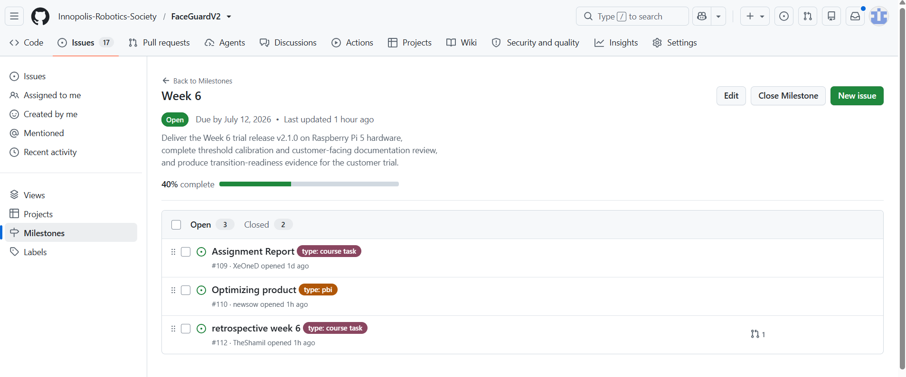
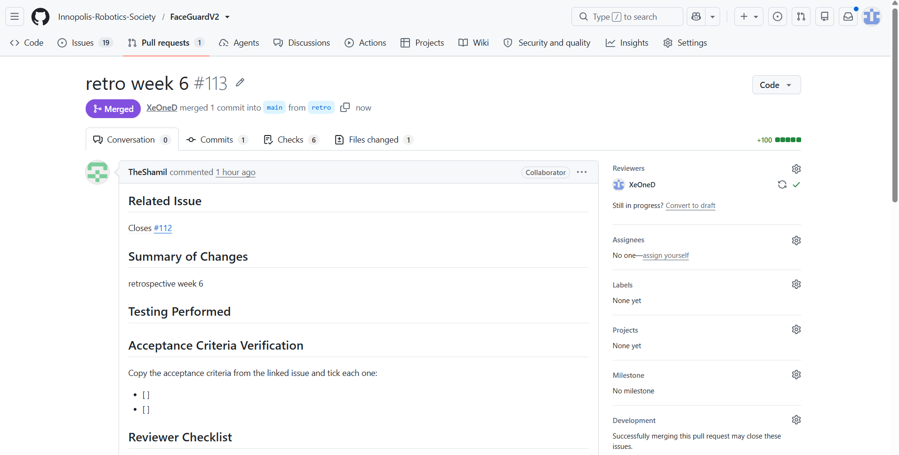

# FaceGuardV2 - Week 6 Report

**FaceGuardV2** is a real-time face-recognition access control system built on Raspberry Pi 5.
The system detects a face, extracts its embedding using InsightFace, compares it against a
registered-user database, and unlocks a physical door via servo motor on successful recognition.
Runs on both Raspberry Pi 5 (ARM) and x86 laptop, with servo visually emulated on x86.

# Link to the Product Backlog board or view
[Product Backlog](https://github.com/Innopolis-Robotics-Society/FaceGuardV2/issues)

# Link to the Sprint 4 Backlog board or view
[Sprint 4 Backlog board](https://github.com/Innopolis-Robotics-Society/FaceGuardV2/milestone/4)

# Link to the Sprint 4 milestone
[Sprint 4 milestone](https://github.com/Innopolis-Robotics-Society/FaceGuardV2/milestone/4)

# Sprint 4 Goal, Sprint dates, and short scope summary

## Sprint Dates
**Start:** 06.07.26  
**End:** 12.07.26

## Sprint Goal
Deliver the almost working product, that is already can be deployed on Raspberry Pi

## Scope summary
- deployment of the docker-containers on the Raspberry Pi
- use the new SD card
- estimate the thresholds for correct face detection

# Total Sprint 4 size in Story Points
ADD THE POINTS

# Summary of the Week 6 trial-release changes
- improved liveness detection
- improved admin panel with convenient settings for giving temporary access
- implemented on Raspberry Pi

# Link to the Week 6 product access artifact

# Link to current access or run instructions

# Links
[README.md](https://github.com/Innopolis-Robotics-Society/FaceGuardV2/blob/main/README.md)  
[CONTRIBUTING.md](https://github.com/Innopolis-Robotics-Society/FaceGuardV2/blob/main/CONTRIBUTING.md)  
[AGENTS.md](https://github.com/Innopolis-Robotics-Society/FaceGuardV2/blob/main/AGENTS.md)  
[docs/customer-handover.md](https://github.com/Innopolis-Robotics-Society/FaceGuardV2/blob/main/docs/customer-handover.md)  
[Hosted documentation site](https://b3ss0n.github.io/FaceGuardV2DocsWebsite/)  

# Summary of the customer-facing documentation review
Customer found that README file with instructions is clear for understanding.
Customer also want to see the site with the description of project. That site is already exist,
and mentioned in the links above. However, we need to apply some non-significant fixes to present it to the customer

# Transition-readiness summary
The product will be ready for transition after we will apply the changes that are
mentioned above in Summary of the Week 6 trial-release changes. Also in the week 7 we need to fix the design of the
admin panel.

# Customer Feedback Response Table

| Feedback Point (Customer Input) | Category | Resulting PBI / Issue |
| :--- | :--- | :--- |
| Rejection of duration-based passes; requires entering specific dates and exact expiration times (hour and minute). | Feature Enhancement | **PBI:** Re-engineer the pass creation workflow to implement an absolute date-picker with hour/minute precision. |
| Identification of high performance overhead, redundant data packets, and unnecessary copying of user embedding arrays. | Backend Performance | **PBI:** Profile and optimize source code to eliminate redundant array-copying operations and trim network packets. |
| Video stream frame rate is insufficient at roughly 15 frames per second. | Hardware Optimization | **PBI:** Optimize the video processing pipeline on the Raspberry Pi to achieve a stable 24–30 FPS. |
| Poor frontend aesthetics, low visibility colors, and jarringly high-contrast dark tables that lack ecosystem consistency. | UI/UX Redesign | **PBI:** Overhaul UI layouts to establish clear color consistency, improve readability, and implement adaptive tables. |
| Repository requires proper organization, descriptive tags, and cleanup to look professional. | Repository Health | **Issue:** Clean up the codebase, remove development clutter, and apply structured version tags. |
| Missing clear deployment documentation, operating conditions, and step-by-step launch guides in the main README. | Documentation | **PBI:** Expand the root README with explicit setup/launch instructions and finalize the SSG site on GitHub Pages. |

The things that are not implemented yet will be implemented during the week 7 and all the PBIs
will be created on GitHub and done on the week 7

# Links
[docs/roadmap.md](https://github.com/Innopolis-Robotics-Society/FaceGuardV2/blob/main/docs/roadmap.md)  
[customer-handover.md](https://github.com/Innopolis-Robotics-Society/FaceGuardV2/blob/main/docs/customer-handover.md)  

# Summary of relevant UAT or customer-trial results
Customer accepted the current condition of the product, while testing it by himself. However,
the way for the future work is declared above in the Customer Feedback Response Table.

# Links
[SemVer trial release]()  
[CHANGELOG.md](https://github.com/Innopolis-Robotics-Society/FaceGuardV2/blob/main/CHANGELOG.md)  
[reports/week6/sprint-review-transcript.md]()  
[reports/week6/reflection.md]()  
[reports/week6/retrospective.md](https://github.com/Innopolis-Robotics-Society/FaceGuardV2/blob/main/reports/week6/retrospective.md)  
[reports/week6/llm-report.md]()  

# Summary of the current product status and expected Week 7 follow-up work
The product is almost ready for release the only things that are supposed to be corrected are
optimization part and fronted part.
 
# Contribution traceability table
| Member | Contribution |
|--------|--------------|
| @Kenzyss |              |
| @newsow |              |
| @b3ss0n |              |
| @NadezhdaVoskan |              |
| @XeOneD |              |
| @TheShamil |              |

# Screenshots
  
  
  