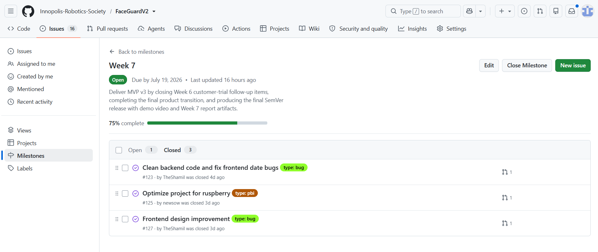
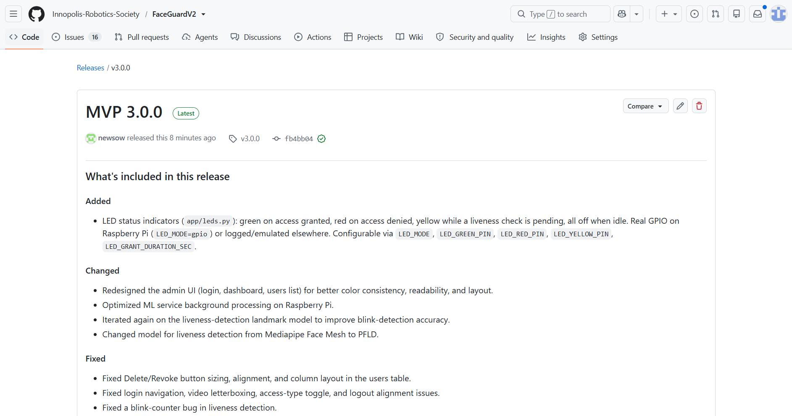
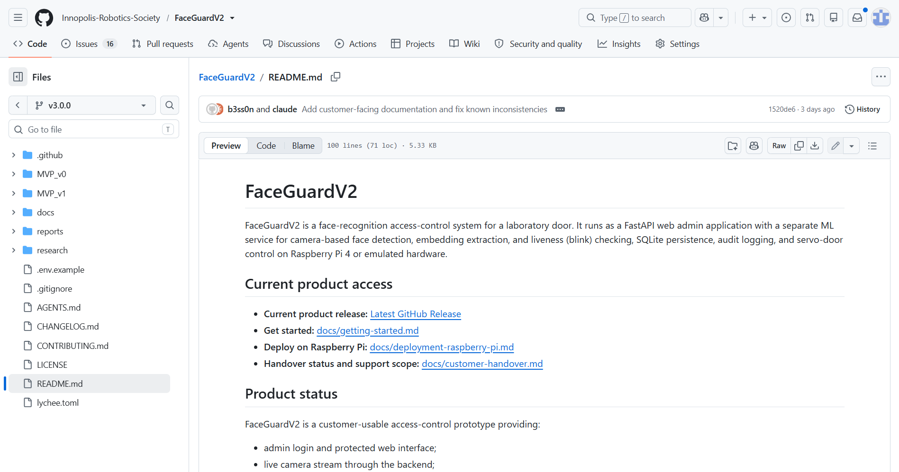
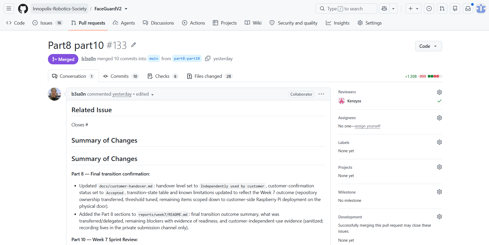

# FaceGuardV2 - Week 7 Report

# Link to reports/week6/README.md
[Week 6 report](https://github.com/Innopolis-Robotics-Society/FaceGuardV2/blob/main/reports/week6/README.md)

# Link to the Product Backlog board or view
[Product Backlog](https://github.com/Innopolis-Robotics-Society/FaceGuardV2/issues)

# Link to the Sprint 5 Backlog board or view
[Sprint 5 Backlog board](https://github.com/Innopolis-Robotics-Society/FaceGuardV2/milestone/5)

# Link to the Sprint 5 milestone
[Sprint 5 milestone](https://github.com/Innopolis-Robotics-Society/FaceGuardV2/milestone/5)

# Sprint 5 Goal, Sprint dates, and short scope summary
## Sprint Dates
**Start:** 13.07.26  
**End:** 19.07.26

## Sprint Goal
Deliver the product, show working product to the customer, fix all the bugs

## Scope summary
- clean backend
- optimize project
- improve frontend

# Total Sprint 5 size in Story Points
14

# Summary of the Week 7 follow-up maintenance and final MVP v3 changes
During Week 7, the team addressed final customer feedback and optimization goals to deliver the production-ready MVP v3 release[cite: 1]. 

### 1. Hardware Integration & LED Signaling
* **LED Status Indicators (`app/leds.py`):** Added hardware status signaling: Green (access granted), Red (access denied), Yellow (liveness check pending), and Off (idle).
* **GPIO & Emulation:** Enabled physical GPIO control on Raspberry Pi (`LED_MODE=gpio`) with automated fallback to emulated status logging on non-ARM systems.
* **Environment Config:** Exposed `LED_GREEN_PIN`, `LED_RED_PIN`, `LED_YELLOW_PIN`, and `LED_GRANT_DURATION_SEC` as configurable environment variables.

### 2. UI/UX & Frontend Overhaul
* **Admin UI Redesign:** Overhauled the login page, dashboard, and users list to ensure color consistency and enhance readability[cite: 1].
* **Layout & Navigation Fixes:** Resolved video stream letterboxing, authorization routing bugs, access-type toggle issues, and logout button misalignment.
* **Table Action Repairs:** Fixed element sizing, alignment, and column constraints for `Delete` and `Revoke` buttons in the registry grid.

### 3. Biometrics & Performance Optimization
* **PFLD Model Migration:** Replaced Mediapipe Face Mesh with the **PFLD** landmark model to significantly increase blink-detection accuracy.
* **Blink Counter Fix:** Squashed a critical runtime bug in the liveness loop to eliminate validation delays.
* **Edge Optimization:** Streamlined the background machine learning pipeline to minimize processing overhead on Raspberry Pi hardware[cite: 1].

### 4. Codebase Health
* **Backend Cleanup:** Purged legacy development artifacts, unused endpoints, and code clutter.
* **Bug Squashing:** Fixed remaining client-side frontend glitches to secure a fully unified, stable deployment.

# Link to the final product access artifact
[Product](https://github.com/Innopolis-Robotics-Society/FaceGuardV2/releases/tag/v3.0.0)

# Link to current access or run instructions
[Instructions](https://github.com/Innopolis-Robotics-Society/FaceGuardV2/blob/v3.0.0/README.md#how-to-run)

# Links
[README.md](https://github.com/Innopolis-Robotics-Society/FaceGuardV2/blob/main/README.md)
[CONTRIBUTING.md](https://github.com/Innopolis-Robotics-Society/FaceGuardV2/blob/main/CONTRIBUTING.md)
[AGENTS.md](https://github.com/Innopolis-Robotics-Society/FaceGuardV2/blob/main/AGENTS.md)
[docs/customer-handover.md](https://github.com/Innopolis-Robotics-Society/FaceGuardV2/blob/main/docs/customer-handover.md)
[Hosted documentation site](https://b3ss0n.github.io/FaceGuardV2DocsWebsite/)

---

## Final transition outcome summary (Part 8)

**Handover level reached:** `Independently used by customer`

**Customer-confirmation status:** `Accepted`

During the Week 7 transition-confirmation session, the customer directly interacted with the
live trial deployment (dashboard, LED status indicators, audit log) rather than only watching a
team-led walkthrough, and explicitly confirmed satisfaction with the project and acceptance of
[`docs/customer-handover.md`](https://github.com/Innopolis-Robotics-Society/FaceGuardV2/blob/main/docs/customer-handover.md)
as sufficient for this handover level.

## Summary of what was transferred, delegated, or made available (Part 8)

As documented in `docs/customer-handover.md`:
* the public repository, current maintained implementation (`MVP_v1/`), setup/run instructions,
  release artifacts, documentation, and reports remain available to the customer for inspection
  and independent review;
* the trial was run and directly used by the customer on the team's Raspberry Pi deployment;
* repository ownership/admin transfer to the customer has been completed;
* deployment on customer-owned infrastructure (the physical lab door) has not been carried out
  and remains intentionally outside this Sprint's scope;
* no private credentials, real biometric data, or private access details were shared through the
  public repository.

## Remaining transition blockers, limitations, and follow-up items (Part 8)

* Repository cleanup is still being finished.
* The public sanitized demo video is expected to be recorded shortly but has not been recorded
  as of this review.
* Long-term deployment/operation on customer-owned infrastructure was not part of this session
  and remains a post-course consideration if pursued; it was not attempted because it falls
  outside the course transition scope, not because of a technical or customer-side blocker.
* No blockers were raised by the customer; all remaining items above are team-side follow-up work.
* **Evidence of readiness already obtained:** the recognition threshold has been tuned and
  confirmed on real trial data, frame rate has been confirmed improved on the Raspberry Pi
  deployment, and the customer directly exercised the live dashboard, LED status indicators, and
  audit log during the Week 7 trial without raising blocking issues.

## Summary of customer-independent use / deployment / operation evidence (Part 8)

During the Week 7 trial, the customer independently exercised the live dashboard, observed and
confirmed correct LED status behavior (liveness check / access granted / access denied), verified
that recognition continues running in the background across browser tabs, and confirmed that the
audit log records only state transitions rather than repeated identical entries. Private recording
and exact timecodes for this session are provided only through the Week 7 Moodle PDF submission
per the public/private evidence-separation rules; this section provides the sanitized public
summary of that evidence.

# Customer feedback response table for Sprint 5 follow-up work
| Feedback Point (Customer Input)                                                                                                | Category | Resulting PBI / Issue                                        |
|:-------------------------------------------------------------------------------------------------------------------------------| :--- |:-------------------------------------------------------------|
| Inquiry regarding system persistence and reliability when switching browser tabs.                                              | System Resilience | **Issue:** Done during sprint 4                              |
| Acknowledgment and confirmation that final detection threshold selection is pending.                                           | Model Calibration | **PBI:** Estimated experimentally                            |
| Confirmation of the absolute requirement to compile final documentation updates and capture a live operational video recording.| Release Artifacts | **PBI:** The product is ready for transition to the customer |

# Summary of relevant Week 7 UAT or customer-trial results

* **Status:** All 7 active UAT scenarios (UAT-001 through UAT-007) passed successfully.
* **Failed Scenarios:** None.

#### Key Validation Outcomes
* **Liveness Verification:** The anti-spoofing mechanism is fully active, successfully rejecting static photos or masks and granting access exclusively to live faces.
* **Performance Enhancements:** Core backend optimizations successfully reduced latency in the recognition cycle and significantly improved UI responsiveness under load.
* **Administrative Operations:** Administrative dashboard management workflows, including single user deletions and batch guest purges, remain fast and intuitive.

#### Product Backlog Impact
* **Defect Status:** Zero critical defects or technical product gaps were identified during this evaluation cycle.
* **Follow-up Items:** Minor user experience (UX) suggestions have been formally deferred to the product backlog.

# Link to the final SemVer release mapped to MVP v3
[MVP v3](https://github.com/Innopolis-Robotics-Society/FaceGuardV2/releases/tag/v3.0.0)

# Links
[CHANGELOG.md](https://github.com/Innopolis-Robotics-Society/FaceGuardV2/blob/main/CHANGELOG.md)

# Link to the public sanitized demo video
[Demo video](https://drive.google.com/drive/folders/1HXWuDomcPfDJLvlL2G_ftuOUz68tVK5l?usp=sharing)

# Demo Day preparation summary
- Checked the functionality of the product
- Composed presentation
- Recorded video demonstration
- Prepared hardware
- Rehearsed the presentation with time and roles

---

## Sprint Review (Part 10)

[reports/week7/sprint-review-transcript.md](sprint-review-transcript.md)
[reports/week7/sprint-review-summary.md](sprint-review-summary.md)

The Week 7 Sprint Review covered: the planned Sprint 5 Goal, the delivered `MVP v3` changes,
resolved and unresolved follow-up issues from Week 6 (frame rate, UI/UX, backend overhead,
threshold tuning, documentation, repository cleanup), the final transition status and usefulness,
customer use/operational status, and remaining risks and post-course limitations. See
[reports/week7/sprint-review-summary.md](sprint-review-summary.md)
for the full breakdown.

# Links
[reports/week7/reflection.md](https://github.com/Innopolis-Robotics-Society/FaceGuardV2/blob/main/reports/week7/reflection.md)
[reports/week7/retrospective.md](https://github.com/Innopolis-Robotics-Society/FaceGuardV2/blob/main/reports/week7/retrospective.md)
[reports/week7/llm-report.md](https://github.com/Innopolis-Robotics-Society/FaceGuardV2/blob/main/reports/week7/llm-report.md)

# Summary of the final product status
The final release of **MVP v3** delivers a fully optimized, secure, and visually polished software-hardware access control system tailored for edge deployment. 

---

#### 1. Biometrics & Security (ML Service)
* **PFLD Liveness Model:** Upgraded the underlying liveness-detection architecture, swapping out Mediapipe Face Mesh for the **PFLD** landmark model to significantly improve blink-detection accuracy.
* **Blink Counter Fix:** Resolved a critical bug in the blink-counter logic to eliminate false positives/negatives during the anti-spoofing challenge.
* **Background Optimization:** Enhanced the ML service background processing pipelines to ensure stable performance and minimized latency under continuous load on the Raspberry Pi.

#### 2. Hardware Integration & Signaling (IoT)
* **LED Status Indicators (`app/leds.py`):** Integrated a real-time hardware status notification system using physical LEDs:
    * **Green:** Access granted.
    * **Red:** Access denied / Unknown user.
    * **Yellow:** Liveness check pending (scanning).
    * **All Off:** System idle.
* **GPIO & Emulation Flexibility:** Supports physical GPIO pin mapping on the Raspberry Pi (`LED_MODE=gpio`) with automated fallback to logged/emulated status tracking on non-ARM environments. Completely configurable via environment variables (`LED_GREEN_PIN`, `LED_RED_PIN`, `LED_YELLOW_PIN`, and `LED_GRANT_DURATION_SEC`).

#### 3. Administrative Web UI Overhaul
* **UI/UX Redesign:** Completely overhauled the aesthetics of the login page, admin dashboard, and users list to establish strict color consistency, remove jarring contrast issues, and maximize text readability.
* **Table Layout Corrections:** Fixed column alignments, sizing constraints, and text clipping for the `Delete` and `Revoke` action buttons within the main users registry table.
* **Navigation & View Repairs:** Resolved video stream letterboxing (black bars), fixed authorization routing flaws, corrected the access-type toggle switch behavior, and properly aligned the logout button.

#### 4. System Stability & Code Cleanup
* **Codebase Pruning:** Conducted a comprehensive cleanup of the backend codebase to eliminate dead functions and development clutter.
* **Bug Squashing:** Resolved miscellaneous client-side frontend rendering bugs, establishing a smooth, seamless production-ready user experience.

# Contribution traceability table
| Member | Contribution                                                                                                                                                                                                                                                                                                                      |
|--------|-----------------------------------------------------------------------------------------------------------------------------------------------------------------------------------------------------------------------------------------------------------------------------------------------------------------------------------|
| @Kenzyss | Did part 12, went to meetings, helped in the lab with Raspberry Pi                                                                                                                                                                                                                                                                |
| @newsow | Optimized the product to work on RPi4 by improving the speed of liveness detection and reducing the load on hardware in the background, connected the LEDs to the logic of face recognition and liveness detection, completed the research of the threshold parameter for face recognition, made the final release of the project |
| @b3ss0n | Fixed frontend bugs, cleaned the repository up, formed customer-facing docs.                                                                                                                                                                                                                                                      |
| @NadezhdaVoskan | Did part 3, part 4, helped with interview and demo video                                                                                                                                                                                                                                                                          |
| @XeOneD | Did part 5, assignment reports in Moodle and repository, conducted interviews                                                                                                                                                                                                                                                     |
| @TheShamil | Completed parts 6, 11 of the assignment, fixed bugs in backend                                                                                                                                                                                                                                                                    |

# Screenshots
  
  
  

